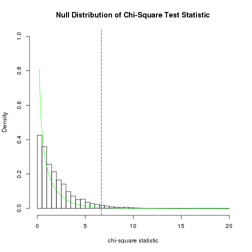
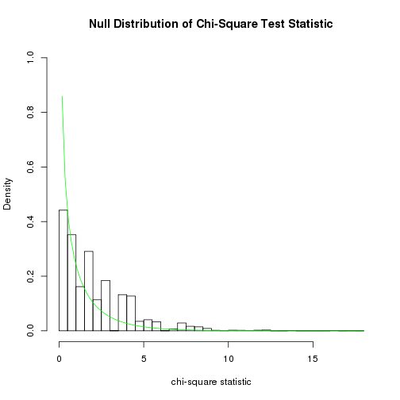

CH3 - Question 2 
In the algorithm for conducting permutation tests, why do we add 1 to the number of replications N when calculating the P value

Adding 1 to both the numerator and the denominator corresponds to including the original data as an extra resample. 

CH3 - Question 3

```r
# 3a.
# Are the delay times are statisticaly different between american and united

# H0: The Mean Delay and the Carrier are Statistically Independent 
# Ha: The Mean Delay and the Carrier are Stastically related
chisq<-function(Observed)
{ 
  Expected <- outer(rowSums(Observed),colSums(Observed))/sum(Observed)
  sum((Observed-Expected)^2/Expected)
}

flights<-read.csv(file=url("http://www1.appstate.edu/~thomleyje/data-files/FlightDelays.csv"))

delays<-subset(flights, select=Delay, drop=T)

test.stat<- round(chisq(Observed), 4)
```

```
## Error in is.data.frame(x): object 'Observed' not found
```

```r
american <- subset(flights, Carrier=='AA')
united <- subset(flights, Carrier=='UA')
obs.diff<-  mean(american$Delay) - mean(united$Delay)

boxplot(MB~Time, data=Skulls, horizontal=T)
```

```
## Error in eval(expr, envir, enclos): object 'Skulls' not found
```

```r
N<-10^5-1
result<-numeric(N)

for (i in 1:N)
{
  index<-sample(4029, size=1123, replace=F)
  result[i]<-mean(delays[index]) - mean(delays[-index])
}
  hist(result, prob=T,
     main="Sampling Permutation Distribution",
     xlab="Randomly Resampled Differences")
abline(v=c(obs.diff,-obs.diff), col="blue",lty=5)
```

 

```r
# Compute both the one-sided p-values based on the test statistic.
pvalue.upper<-(sum(result>=obs.diff)+1)/(N+1)
pvalue.lower<-(sum(result<=obs.diff)+1)/(N+1)

pvalue.two<-format(2*min(pvalue.upper,pvalue.lower),scientific=F)


sum(united$Delay) #= 17949
```

```
## [1] 17949
```

```r
sum(american$Delay) #= 29343
```

```
## [1] 29343
```

```r
# The sum of delays on american airlines flights were significantly longer there was a week of delays between the two airlines.
  
# 3b. Compare delay between may and june

  # H0. The month a flight occurs, and the Delay of a flight are independent

  # H1. The month a flight occurs, and the Delay of a flight are not independent

june <-subset(flights, Month=="June")
may <- subset(flights, Month=="May")

obs.diff <- mean(may$Delay) - mean(june$Delay)

result<-numeric(N)
for(i in 1:N)
  {
  index<-sample(4029, size=1999, replace=F)
  result[i]<-mean(delays[index]) - mean(delays[-index]) 
  }

  hist(result, prob=T,
     main="Sampling Permutation Distribution",
     xlab="Randomly Resampled Differences")
abline(v=c(obs.diff,-obs.diff), col="blue",lty=5)
```

 

```r
# Compute both the one-sided p-values based on the test statistic.
pvalue.upper<-(sum(result>=obs.diff)+1)/(N+1)
pvalue.lower<-(sum(result<=obs.diff)+1)/(N+1)

pvalue.two<-format(2*min(pvalue.upper,pvalue.lower),scientific=F) # = 2 * 10 ^ -5 we reject H0 at .001 
sum(may$Delay) #= 17760
```

```
## [1] 17760
```

```r
sum(june$Delay) #= 29532
```

```
## [1] 29532
```

```r
# Significantly more delays occured in june than in may.
```

Question 4a

```r
flights<-read.csv(file=url("http://www1.appstate.edu/~thomleyje/data-files/FlightDelays.csv"))
united<- subset(flights, Carrier=='UA')
american <- subset(flights, Carrier=='AA')


delays20<-subset(flights, Delay>20)
united.20<-subset(delays20, Carrier=='UA')
american.20<-subset(delays20, Carrier=='AA')

#Proportion Stuff
united.prop <- sum(united.20$Delay) / sum(united$Delay)
american.prop <- sum(american.20$Delay) / sum(american$Delay)
### 

obs.diff <- mean(united$Delay > 20) - mean(american$Delay > 20)

N<- 10^4-1 
result<-numeric(N)
for(i in 1:N)
  {
    index <- sample(4029, size=1123, replace=F)
    result[i] <- mean(flights$Delay[index] > 20) - mean(flights$Delay[-index] > 20)
  }

  hist(result, prob=T,
     main="Sampling Permutation Distribution",
     xlab="Randomly Resampled Differences")
abline(v=c(obs.diff,-obs.diff), col="blue",lty=5)
```

 

```r
# Compute both the one-sided p-values based on the test statistic.
pvalue.upper<-(sum(result>=obs.diff)+1)/(N+1)
pvalue.lower<-(sum(result<=obs.diff)+1)/(N+1)

pvalue.two<-format(2*min(pvalue.upper,pvalue.lower),scientific=F) # the difference in the proportion of delays is significant
sum(united$Delay > 20)  #= 239
```

```
## [1] 239
```

```r
sum(american$Delay > 20) #= 492 # American has more delays longer than 20 minutes
```

```
## [1] 492
```

Problem 11. 

```r
  chisq<-function(Observed)
  { 
    Expected <- outer(rowSums(Observed),colSums(Observed))/sum(Observed)
    sum((Observed-Expected)^2/Expected)
  }
 #H0: Age and Marijuana preference are Independent 
 #HA: Age and Marijuana preference are not Independent
  marijuana <- read.csv(file=url("http://www1.appstate.edu/~thomleyje/data-files/Marijuana.csv"))
  age<-subset(marijuana, select='Age', drop=T)
  preference <- subset(marijuana, select='Response', drop=T)
  Observed<-table(age,preference)

  test.stat <- round(chisq(Observed),4)
  Expected <- outer(rowSums(Observed),colSums(Observed))/sum(Observed)
  N <- 10^4-1
  result<-numeric(N)
  for (i in 1:N)
  {
    ST.perm <-sample(age)
    RND.table <- table(preference, ST.perm)
    result[i]<-chisq(RND.table)
  }

  UL<-round(max(result),0)+1
hist(result, prob=T,
     main="Null Distribution of Chi-Square Test Statistic",
     breaks=seq(0,UL,by=0.5),
     xlab="chi-square statistic", 
     xlim=c(0,UL),
     ylim=c(0,1))
abline(v=test.stat,
       col="blue",
       lty=5)   
curve(dchisq(x, df=1), 
      from=0, 
      to=UL, 
      col="green", 
      add=T) 
```

 

```r
print(paste0("The chi-square test statistic is ", test.stat),quote=F)
```

```
## [1] The chi-square test statistic is 6.6814
```

```r
print(paste0("The p-value for the chi-square test of independence is ",format((sum(result >= test.stat) + 1)/(N + 1),scientific=F)),quote=F)
```

```
## [1] The p-value for the chi-square test of independence is 0.0339
```

```r
# We can reject H0 at the .05 level but not the .01 level or .001 level
```
12.

```r
  chisq<-function(Observed)
  { 
    Expected <- outer(rowSums(Observed),colSums(Observed))/sum(Observed)
    sum((Observed-Expected)^2/Expected)
  }
  
  Cereal <- read.csv(file=url("http://www1.appstate.edu/~thomleyje/data-files/Cereals.csv"))

  
  chisq.test(Cereal$Shelf, Cereal$Age)
```

```
## Warning in chisq.test(Cereal$Shelf, Cereal$Age): Chi-squared approximation
## may be incorrect
```

```
## 
## 	Pearson's Chi-squared test
## 
## data:  Cereal$Shelf and Cereal$Age
## X-squared = 28.6252, df = 2, p-value = 6.083e-07
```

```r
  # H0: Cereal Box Shelf Placement is independent of Age of the Consumer
  # HA: Cereal Box Shelf Placement is not independent of Age of the Consumer


  # There are 2 degrees of freedom, and they are using a computed mean and standard deviation.. 
  age <- subset(Cereal, select='Age', drop=T)
  shelf<- subset(Cereal, select='Shelf', drop=T)
  Observed<-table(age, shelf)
  test.stat <- round(chisq(Observed),4)

  Expected <- outer(rowSums(Observed),colSums(Observed))/sum(Observed)
N <- 10^4-1
result<-numeric(N)
for (i in 1:N)
{
  ST.perm <-sample(shelf)
  RND.table <- table(age, ST.perm)
  result[i]<-chisq(RND.table)
}
  
UL<-round(max(result),0)+1
hist(result, prob=T,
     main="Null Distribution of Chi-Square Test Statistic",
     breaks=seq(0,UL,by=0.5),
     xlab="chi-square statistic", 
     xlim=c(0,UL),
     ylim=c(0,1))
abline(v=test.stat,
       col="blue",
       lty=5)   
curve(dchisq(x, df=1), 
      from=0, 
      to=UL, 
      col="green", 
      add=T) 
```

 

```r
print(paste0("The chi-square test statistic is ", test.stat),quote=F)
```

```
## [1] The chi-square test statistic is 28.6252
```

```r
print(paste0("The p-value for the chi-square test of independence is ",format((sum(result >= test.stat) + 1)/(N + 1),scientific=F)),quote=F)
```

```
## [1] The p-value for the chi-square test of independence is 0.0001
```

```r
# We reject the null at .001 and we conclude that cereal box placement is not independent
```
13. 

```r
# This requires a test of homogenity, in order to see if the fish have the same number of rays
 
# H0: The region is independent of the fishes number of rays
# HA: The region is not independent of the fishes number of rays
  chisq<-function(Observed)
  { 
    Expected <- outer(rowSums(Observed),colSums(Observed))/sum(Observed)
    sum((Observed-Expected)^2/Expected)
  }
  


fish <- read.csv(file=url("http://www1.appstate.edu/~thomleyje/data-files/FishRays.csv"))
habitat<-subset(fish, select='Habitat', drop=T)
count <- subset(fish, select='Count', drop=T)
observed<-table(habitat, count)

test.stat <- round(chisq(observed),4)
Expected <- outer(rowSums(observed),colSums(observed))/sum(observed)

N<- 10^4 - 1
result<-numeric(N)
for (i in 1:N)
  {
  ST.perm <-sample(count)
  RND.table<-table(habitat, ST.perm)
  result[i]<-chisq(RND.table)
  }
UL<-round(max(result),0)+1
hist(result, prob=T,
     main="Null Distribution of Chi-Square Test Statistic",
     breaks=seq(0,UL,by=0.5),
     xlab="chi-square statistic", 
     xlim=c(0,UL),
     ylim=c(0,1))
abline(v=test.stat,
       col="blue",
       lty=5)   
curve(dchisq(x, df=1), 
      from=0, 
      to=UL, 
      col="green", 
      add=T) 
```

 

```r
print(paste0("The chi-square test statistic is ", test.stat),quote=F)
```

```
## [1] The chi-square test statistic is 12.8059
```

```r
print(paste0("The p-value for the chi-square test of independence is ",format((sum(result >= test.stat) + 1)/(N + 1),scientific=F)),quote=F)
```

```
## [1] The p-value for the chi-square test of independence is 0.2296
```

```r
# We do not reject H0 becauseour Pvalue is > .05
```
19.
Probabilities will not change, neither will degrees of freedom. Simply multiplying does not change our conclusion

23. 

```r
 # H0: The data are consitentant with the normal curve
 # HA: The data are not consistent with the normal curve.
E<-c(.2,.4,.6,.8)
O<-qnorm(E, 25, 10) 
sum <- c(sum(O <= 17),
         sum(O <= 22) - sum(O <= 17),
         sum(O<=28) - sum(O <= 22),
         sum(O<=33) - sum(O <= 28),
         sum(O > 33)
         )

test.stat<- sum(((O-E)^2)/E)

pvalue <- pchisq(test.stat, 4, lower.tail=F) # It does appear to be normal, but 25 and 10 are not the values used
# B. 
# H0: The data are consistant with the normal curve
# HA: The data are not consistant with the normal curve

E<-c(.2,.4,.6,.8)
O<-qnorm(E, 30.328, 6.54)
sum <- c(sum(O <= 25,
         sum(O <= 29) - sum(O <= 25),
         sum(O<=32) - sum(O <= 29),
         sum(O<=36) - sum(O <= 32),
         sum(O > 36)
         ))
test.stat <- sum(((O-E)^2)/E)
pvalue<- pchisq(test.stat, 2, lower.tail=F)

# The data appears to be normal, however 30.328 and 6.54 do seem to mu and theta
```
