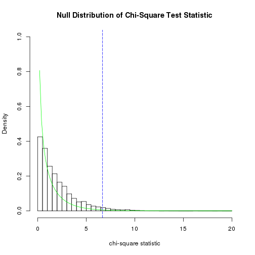

--- 
Title: Exam 2
Author: Taylor King
---

Problem 1 
---

```r
  mandm.data<-read.csv(file=url("http://www1.appstate.edu/~thomleyje/data-files/MandM.csv"))
# A. Create a contigency table showing the observed counts for mariage vs marijuana preference
  table(mandm.data$Marriage, mandm.data$Marijuana)
```

```
##      
##       No Yes
##   No  14   2
##   Yes 15  19
```

```r
# Rows represent married or unmarried and coilums represent marijuana preference

# B. The independence test would probably be more appropriate here. Trying to decide whether marittal status and marijuana preference are independent
# C.
  #H0. Marital status and marijuana preference are independent.
  #HA. Marital status and marijuana preference are not independent.

  chisq <- function(Observed)
  {
    Expected <- outer(rowSums(Observed),colSums(Observed))/sum(Observed)
      sum((Observed-Expected)^2 /Expected)
  }
  marriage<-subset(mandm.data,select=Marriage, drop=T)
  marijuana <- subset(mandm.data,select=Marijuana, drop=T)
  Observed<-table(marriage, marijuana)
  test.stat <- round(chisq(Observed),4)
  Expected<- outer(rowSums(Observed), colSums(Observed))/sum(Observed)
  N<- 10^4-1
  result<-numeric(N)
  for(i in 1:N)
    {
      ST.perm <- sample(marriage)
      RND.table<- table(marijuana, ST.perm)
      result[i] <- chisq(RND.table)
    }
    UL<-round(max(result), 0)

hist(result, prob=T,
     main="Null Distribution of Chi-Square Test Statistic",
     breaks=seq(0,UL,by=0.5),
     xlab="chi-square statistic", 
     xlim=c(0,UL),
     ylim=c(0,1))
abline(v=test.stat,
       col="blue",
       lty=5)   
curve(dchisq(x, df=1), 
      from=0, 
      to=UL, 
      col="green", 
      add=T) 
```

 

```r
print(paste0("The chi-square test statistic is ", test.stat),quote=F)
```

```
## [1] The chi-square test statistic is 8.4058
```

```r
print(paste0("The p-value for the chi-square test of independence is ",format((sum(result >= test.stat) + 1)/(N + 1),scientific=F)),quote=F)
```

```
## [1] The p-value for the chi-square test of independence is 0.0027
```

```r
# We reject H0, Because the Chisq < .05 and can conclude that Marriage and Marijana preference are not independent.
# If a state supports same sex marriage they are likeley to support the use of medicinal marijuana.
```

Problem 2 
---

```r
  chisq <- function(Observed)
  {
    Expected <- outer(rowSums(Observed),colSums(Observed))/sum(Observed)
      sum((Observed-Expected)^2 /Expected)
  }
mandm.data<-read.csv(file=url("http://www1.appstate.edu/~thomleyje/data-files/MandM.csv"))
# Create tables showing both the observed counts for both region and marijuana
observed.marijuana<-table(mandm.data$Region, mandm.data$Marijuana)
observed.marriage<-table(mandm.data$Region, mandm.data$Marriage)
print(observed.marijuana)
```

```
##            
##             No Yes
##   Midwest    9   3
##   Northeast  2   7
##   Pacific    0   2
##   South     15   1
##   West       3   8
```

```r
print(observed.marriage)
```

```
##            
##             No Yes
##   Midwest    5   7
##   Northeast  0   9
##   Pacific    0   2
##   South     10   6
##   West       1  10
```

```r
# B. This test since exploring the relation of region, same sex marriage law and medicanal marijauana would be a test of homogeneity since we want to explore wheter or not the data is consistant accreoss region
```


C: 
H0: $\pi_{Same Sex Marriage_{South}}\ \= \pi_{Same Sex Marriage{West}}\ \= \pi_{Same Sex Marriage_{Midwest}}\ \= \pi_{Same Sex Marriage_{Northeast}}\ \= \pi_{Same Sex Marriage_{Pacific}}\ $


```r
# D.
  region<-mandm.data$Region
  marriage<-mandm.data$Marriage
  marijuana<-mandm.data$Marijuana
  observed.marriage<-table(region,marriage)

  test.stat<-round(chisq(observed.marriage),4)
  Expected <- outer(rowSums(observed.marriage), colSums(observed.marriage))/ sum(observed.marriage)
  N <- 10^4-1
  result<-numeric(N)
  for(i in 1:N)
    {
      ST.perm <- sample(marriage)
      RND.table<- table(region, ST.perm)
      result[i] <- chisq(RND.table)
    }
    UL<-round(max(result), 0)

#hist(result, prob=T,
     #main="Null Distribution of Chi-Square Test Statistic",
     #breaks=seq(0,UL,by=0.5),
     #xlab="chi-square statistic", 
     #xlim=c(0,UL),
     #ylim=c(0,1))
#abline(v=test.stat,
       #col="blue",
       #lty=5)   
#curve(dchisq(x, df=1), 
      #from=0, 
      #to=UL, 
      #col="green", 
      #add=T) 

print(paste0("The chi-square test statistic is ", test.stat),quote=F)
```

```
## [1] The chi-square test statistic is 15.1849
```

```r
print(paste0("The p-value for the chi-square test of independence is ",format((sum(result >= test.stat) + 1)/(N + 1),scientific=F)),quote=F)
```

```
## [1] The p-value for the chi-square test of independence is 0.0034
```

```r
# We get a p-value of ~.0024 which is less than .05 so we can reject H0
#we can say that same sex marriage legal status is not homogenous accross 
#regions in the united states 
# Going to test marriage 

  test.stat<-round(chisq(observed.marijuana),4)
  Expected <- outer(rowSums(observed.marijuana), colSums(observed.marijuana))/ sum(observed.marijuana)
  N <- 10^4-1
  result<-numeric(N)
  for(i in 1:N)
    {
      ST.perm <- sample(marijuana)
      RND.table<- table(region, ST.perm)
      result[i] <- chisq(RND.table)
    }
    UL<-round(max(result), 0)

hist(result, prob=T,
     main="Null Distribution of Chi-Square Test Statistic",
     breaks=seq(0,UL,by=0.5),
     xlab="chi-square statistic", 
     xlim=c(0,UL),
     ylim=c(0,1))
abline(v=test.stat,
       col="blue",
       lty=5)   
curve(dchisq(x, df=1), 
      from=0, 
      to=UL, 
      col="green", 
      add=T) 
```

 

```r
print(paste0("The chi-square test statistic is ", test.stat),quote=F)
```

```
## [1] The chi-square test statistic is 21.5728
```

```r
print(paste0("The p-value for the chi-square test of independence is ",format((sum(result >= test.stat) + 1)/(N + 1),scientific=F)),quote=F)
```

```
## [1] The p-value for the chi-square test of independence is 0.0001
```

```r
# The chi sq value is ~.0001 < .05 so we can reject H0, and conclude that law of medicinal marijuana is not homogenous accross regions.


observed.marijuana<-table(mandm.data$Region, mandm.data$Marijuana)
observed.marriage<-table(mandm.data$Region, mandm.data$Marriage)
print(observed.marijuana)
```

```
##            
##             No Yes
##   Midwest    9   3
##   Northeast  2   7
##   Pacific    0   2
##   South     15   1
##   West       3   8
```

```r
print(observed.marriage)
```

```
##            
##             No Yes
##   Midwest    5   7
##   Northeast  0   9
##   Pacific    0   2
##   South     10   6
##   West       1  10
```

```r
# Discussing the table of marijuana / region we can see that the south is the number of the highest number of states where medicinal marijuana is still illegal.
# Discussing the tables of marriage here, we can see that the south has the fewest number of states where same sex marriage is legal. In the North East the number is the highest.
# 
```

Problem 3
---


```r
draft<- read.csv(file=url("http://www1.appstate.edu/~thomleyje/data-files/Draft.csv"))
firstHalf<-subset(draft,Half=='First')
secondHalf <- subset(draft, Half=='Second')
obs.diff<-mean(firstHalf$Number.1970) - mean(secondHalf$Number.1970)
draftNumbers <- subset(draft, select=Number.1970, drop=T)


N<- 10^5 -1 
result<- numeric(N) 
for(i in 1:N)
  {
    index<-sample(366 ,size=182,replace = F)
    result[i] <- mean(draftNumbers[index]) - mean(draftNumbers[-index])
 }
  hist(result, prob=T,
        main="Sampling Permutation Distribution",
        xlab="Randomly Resampled Differences")
  abline(v=c(obs.diff,-obs.diff), col="blue",lty=5)
```

 

```r
  pvalue.upper<-(sum(result>=obs.diff)+1)/(N+1)
  pvalue.lower<-(sum(result<=obs.diff)+1)/(N+1)

pvalue.two<-format(2*min(pvalue.upper,pvalue.lower),scientific=F)
print(paste0("The two-sided P-Value is close to .0001, we reject H0 and conclude that the distrobution of draft numbers, the numbers from the First half of the year are significantlly greater than the numbers from the second half:", pvalue.two),quote=F)
```

```
## [1] The two-sided P-Value is close to .0001, we reject H0 and conclude that the distrobution of draft numbers, the numbers from the First half of the year are significantlly greater than the numbers from the second half:0.00002
```

Problem 4
---

```r
lottery<-read.csv(file=url("http://www1.appstate.edu/~thomleyje/data-files/Lottery.csv"))
skulls<-read.csv(file=url("http://www1.appstate.edu/~thomleyje/data-files/EgyptianSkullsA.csv"))
win<-lottery$Win
distrib <- numeric(39)
# Part A.
for (i in 1:39)
{
distrib[i] <- sum(win == i)
}
expected <- rep(500/39, 39) # since the distrobution is random, we would expect to see 500/39 of each number.. 
obs.diff<- sum((distrib - expected) ^ 2 / expected)
pchisq(obs.diff, 38, lower.tail=F) # We have 38 degrees of freedom since our DF is equal to N -1 
```

```
## [1] 0.669616
```

```r
# Part B. 
skulls.200 <- subset(skulls, Time=='200')
N<-sum(complete.cases(skulls.200$MB))

mean.skulls<-mean(skulls.200$MB)
sd.skulls <- sd(skulls.200$MB)
Q<-qnorm(c(.2,.4,.6,.8),mean.skulls, sd.skulls)
E<- rep(c(.20*N), 5)
O<-c(sum(skulls.200$MB < Q[1]), 
  sum(skulls.200$MB< Q[2]) - sum(skulls.200$MB < Q[1]), 
  sum(skulls.200$MB < Q[3]) - sum(skulls.200$MB < Q[2]),
  sum(skulls.200$MB < Q[4]) - sum(skulls.200$MB < Q[3]),
  sum(skulls.200$MB >= Q[4]))

test.stat <- sum((O - E) ^ 2 / E)
pvalue <- pchisq(test.stat, df=5 - 3, lower.tail=F) # Here we have 5 variables we are using computed mean and sd 
print(pvalue)
```

```
## [1] 0.2231302
```
Problem 5 
---
$4(Expected)=\ 2m + 20$, So$\ Expected=\ \frac{2m + 20}{4}\ \therefore\ Expected=.5m+5$
We can solve this problem by solving for $m$ in the equation $.05\ \leq\ 2(\frac{(m-(.5m-5))^{2}}{.5m+5})\ +\ 2(\frac{(10-(.5m-5))^{2}}{.5m+5})$

```
